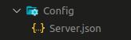
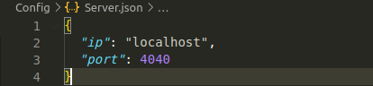

# jsconf
json save config - это библиотека легкого задания конфигурационных файлов, с возможностью хеширования файлов.


---

- ## Установка
        pip install jsconf
<br>

- ## Описание
    - ### Сохранения файла
        Для использования класса **Config**, нужно задать три основных параметра:
        - name_config - Имя файла
        - path_folder - Путь к папке в которой будет находится файл (заботиться о существовании пути не нужно)
        - param_dict - Словарь с необходимыми параметрами

        После чего достаточно вызвать функцию `save_config()`, она сохранит файл, если файл уже был сохранен, он будет перезаписан.

        ``` python
        conf_server = Config('Server', './Config/', dict(ip='localhost', port=4040))

        conf_server.save_config()
        ```
         

        ---

    - ### Загрузка файла
        Чтоб загрузить файл в память объекта воспользуемся функцией `loading_config()`, она возвращает такой же словарь что и был передан на сохранение.
        ``` python
        print(conf_server.loading_config())
        ```
        `>>> {'ip': 'localhost', 'port': 4040}`


---

- ## Хеширование
    Хеширование пригодится если нужно отследить изменялся ли файл из вне, и если изменялся то задать параметры по умолчанию.
    - ### Сохранения файла
       **описание появится позже**
